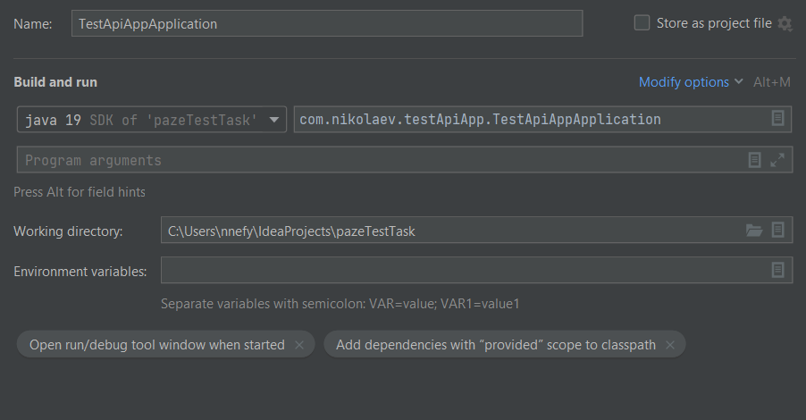

# pazeTestTask
Тестовый проект для команды Paze.eu

Необходимо было сделать приложение, которое будет обращаться к внешнему API /api/v1/payments,
выполняя POST request с параметрами paymentType=DEPOSIT, paymentMethod=BASIC_CARD,
а также с веденными пользователем валютой и суммой.

При успешном обращении необходимо было выполнить редирект на приходящий в ответе URL,
при неудаче выводить ошибку.

# Инструкция по установке и эксплуатации

## Установка:

* Склонировать проект из репозитория <https://github.com/efymich/pazeTestTask>
* Для IntelliJ IDEA Community edition создать новую конфигурацию со следующими параметрами

* Запустить

## Эксплуатация:

В API доступны два метода:

* GET /payments
* POST /payments

При обращении с помощью GET **_/payments_** произойдёт обращение к форме, где необходимо
будет задать валюту и сумму перевода.
После этого нажать на кнопку ```Pay```.

При успешном запросе произойдёт редирект на форму перевода.
Если же возникла ошибка, будет показана форма с сообщением об ошибке, а также
возможностью вернуться на страницу с начальной формой.
